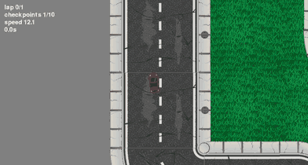

# Neural Network Car Racing

A 2D racing game in Pygame, and the neuroevolution pipeline that produces its
opponents. The neural network is written from scratch in pure Python, with no
NumPy and no machine-learning library of any kind inside it, and it is trained
by a genetic algorithm against a headless, deterministic simulation of the
game's own physics.



*One full circuit by the generation-193 network in 15.3 simulated seconds. It
clears 8 of the 10 checkpoints because the track is a double loop and the outer
ring does not pass the other two; see [The track is a double
loop](#the-track-is-a-double-loop). The frames come straight out of the
simulation via `scripts/watch.py --record`, so anyone who clones this can
regenerate them.*


## At a glance

| | |
|---|---|
| Network | 6-12-10-8-2 feed-forward, 320 parameters, pure Python |
| Inputs | 5 range sensors plus speed, sampled 50 times a second |
| Search | 200 generations of 100 networks, 40,000 rollouts, 30.6M simulated ticks |
| Training cost | 22 minutes on a 4-core laptop |
| Simulator | 8,325 ticks/sec in one process, around 23,000 across 8 workers |
| Determinism | bit-identical results at any worker count, from one seed |
| Hot paths | flat-cost vectorised raycasting, hand-fused forward pass |
| Tests | 173 tests, 87% coverage, Python 3.9 through 3.13 in CI |

---

## Quickstart

```bash
pip install -r requirements.txt

python main.py                                      # play
python scripts/watch.py --model models/hard.pkl     # watch a trained network drive
python scripts/watch.py --model models/hard.pkl --record results/demo.gif
python scripts/train.py --generations 200 --population 100 --workers 8
python scripts/benchmark.py --out docs/optimised.json
pytest
```

Python 3.9 or newer. The only dependencies are `pygame` and `numpy`, and NumPy
is confined to the simulator's raycasting and occupancy grid.

---

## What the network sees

```
                       ┌───────────────────────────────────────┐
  5 range sensors ────►│                                       │────► accelerate
                       │   6 → 12 → 10 → 8 → 2                 │
                       │   fully connected, tanh, 320 weights  │
  current speed   ────►│                                       │────► steer
                       └───────────────────────────────────────┘
```

Five distance readings and a scalar speed go in; how hard to accelerate and how
hard to turn come out. The network has no map, no waypoint list and no notion of
a racing line. Everything it knows about the circuit it infers from six numbers,
fifty times a second.

---

## The network, written from scratch

`src/nncar/neural_network.py` imports only `random`, `math` and `copy`.
`tests/test_purity.py` parses the module with `ast` and fails the build if
anything else ever appears in it, and CI runs that test as a separate job. The
matrix multiply, the matrix addition, the Gaussian weight initialisation by
Box-Muller transform, `tanh` and the mutation operator are all written out
longhand.

**Two implementations of the forward pass, held bit-identical.** The composed
version built from the matrix helpers is the readable definition of what a layer
computes. The flat version, `forward_propagation`, is the hot path: it runs once
per car per frame, and a training run evaluates it tens of millions of times. It
fuses the multiply-accumulate, the bias and the activation into a single pass
over plain floats, which measures **2.1x** faster (35.6 µs against 75.0 µs,
timed in the same process). `tests/test_forward.py` checks the two agree bit for
bit across 500 random networks and on saturating inputs, the benchmark refuses
to report a ratio until it has confirmed the same over 200 networks, and both
still reproduce a golden file of recorded activations.

The accumulation is an explicit `for ...: total += w * v` loop.
`sum(map(mul, ...))` measures faster still, but CPython 3.12 gave `sum()`
compensated floating-point summation, which changes the last bits of the result.
Bit-identity is the requirement, so the plain loop stays.

### Why the inputs are scaled

Sensor distances reach 700 pixels while weights are initialised from `N(0,1)`,
so first-layer pre-activations average around **10³**. At that magnitude the
saturation clamp pins **99.7%** of hidden units to exactly ±1 and the layer
degenerates into `sign(z)`, a piecewise-constant function of its inputs.

That is close to unlearnable by mutation. Almost every small perturbation of a
weight changes nothing at all, and the rare one that flips a sign changes the
output discontinuously, so the search faces a flat landscape with occasional
cliffs and no slope to follow anywhere. Scaling each sensor by its own maximum
range brings mean `|z|` down from **1060 to 1.98** and saturation to **12%**,
which puts `tanh` back in the region where a small change to a weight makes a
small change to the output.

Measured over 200 random networks and pinned in
`tests/test_forward.py::test_raw_pixel_inputs_saturate_the_first_layer`.

---

## How it learns

A population of 100 networks over 200 generations. Each generation is ranked;
the top 5 carry through untouched, 5% of the next generation are fresh random
networks, and the rest are mutated copies of parents drawn by 3-way tournament
from the top 20. Mutation adds `sigma * N(0,1)` to every parameter, with sigma
decaying exponentially from 0.15 to 0.02 across the run, so the search takes
coarse steps while the population is bad and fine ones once it is good.

**Fitness is the worst of two spawn points.** Every network is evaluated from
two different starting positions and scored on the *minimum* of the two. A
network that memorises one opening and fails from the other is worth nothing
under that rule, which pushes the population toward policies that read their
sensors. The three shipped models each finish from all five spawn points,
including the three they never trained on.

**Selection is by rank.** Roulette-wheel selection needs non-negative fitness,
and cars that crash immediately routinely score below zero, so it would force an
arbitrary rescaling of every score in every generation. Ranking is invariant to
how the scores happen to be scaled and needs no such fudge.

**Elitism guarantees monotone progress.** Copying the best individual forward
unchanged means the best score can never fall, which is what makes the best
fitness trace above a clean monotone curve.

**Crossover sits behind a flag as a measurable ablation.** Two networks that
both drive well may have arrived at unrelated internal arrangements, with hidden
unit three in one doing the job of unit seven in the other, so splicing their
weights tends to produce something worse than either parent. This is the
competing conventions problem, and `--crossover-rate` keeps the question
measurable.

Ranking uses the project's own merge sort with ties broken on individual id, so
the order never depends on scheduling or dictionary order. That is one of the
pieces that makes a run reproducible across worker counts.

### Designing the fitness function was the hard part

The search optimises exactly what is written down, including the parts nobody
meant. Three properties of this scoring function exist to close specific holes,
and each has a regression test.

**Progress is counted in checkpoints, and laps have to be earned.** The game's
lap counter increments whenever a car crosses the finish line heading north, and
every spawn point sits north of that line. A network can therefore reverse about
120 pixels, drive forward again, and bank a lap in roughly 30 ticks having
passed zero checkpoints, repeating that indefinitely. The same crossing resets
the collision count, which would launder the crash penalty as well. Any fitness
of the form `laps * w + checkpoints` is trivially farmed, and a search will find
it, because it is a far shorter path to a high score than learning to steer.
Fitness therefore scores checkpoints, the rollout banks each circuit's
checkpoint count as it happens, and a lap only counts once it has cleared enough
of them. `test_the_free_lap_exploit_scores_nothing` pins that exploit at zero.

**Progress is the best single circuit.** Summing checkpoints across every
circuit a car attempts sounds like "how far did it get" and pays for something
else entirely: a driver clearing eight checkpoints on each of two laps banks
sixteen and beats one that clears ten in a single clean lap. A 200-generation
run under that rule produces a champion with per-lap gate counts of `(7, 8)`,
which has correctly learned that circling pays better than improving and never
clears more than eight in a row. Scoring the best single circuit removes the
incentive: eight is worth less than ten however many times it is repeated, and
lapping again only costs time. That same champion is worth 797 here against the
2229 a summing rule pays it, and
`test_going_round_twice_badly_loses_to_once_well` keeps the ordering fixed.

**Standing still can never be optimal.** A car that never moves takes no penalty
at all, so if the worst crash penalty a car can accumulate exceeded what a
checkpoint pays, the global optimum would be to sit on the start line. The
invariant `collision_penalty * collision_limit < progress_weight` rules that
out, and `check_weights` asserts it before a run starts.

Speed enters the score as a rate, `checkpoints / seconds`, so it rewards
covering the same ground faster. Subtracting elapsed ticks instead would punish
a car for getting further before it stopped, which is the opposite of the
intended pressure. Finishing pays a bonus scaled by the fraction of the tick
budget left unused.

Rollouts are retired early by two independent rules: no checkpoint progress for
400 ticks, a generous bound because the widest gap between gates is around two
thousand pixels; and less than 50 pixels of displacement over a 100-tick window,
a tight bound that catches spinning, wall-hugging and wedged cars at once. Both
rules are needed, and together they cut a generation-zero rollout from three
thousand ticks to a couple of hundred.

### The track is a double loop


Two of the ten checkpoints sit on an inner section and the other eight lie on
the outer ring. Driving the outer ring is a complete closed lap that crosses the
finish line; it is simply not the route the checkpoint list describes. A trained
network clearing "8 of 10" is what driving the shortest closed circuit correctly
looks like, so a lap requires eight checkpoints, with the reason recorded where
the constant lives. A network that does find the inner section still scores
higher for it, because ten beats eight.

`scripts/plot_track.py` draws the map above, which is the figure that settled
this.

---

## The simulation

**One copy of the physics.** The trainer drives the game's own `Car` and `NPC`
classes, so there is no second implementation that could drift out of step with
what a player experiences. What differs is only the surroundings: no window, no
audio, no traffic, and a clock counted in ticks that the loop advances, with no
wall-clock reads anywhere in the simulation. A 1.5 second timer is exactly 75
ticks at any speed, so a run means the same thing on a fast machine as on a slow
one.

**Walls live in an occupancy grid.** The three border images are 3608x3081 RGBA
surfaces, about 133 MB decoded. They are collapsed once into a single array of
flags, cached on disk and keyed on the contents of the PNGs, and both the
sensors and the collision test answer from that array. Dropping the surfaces
frees the 133 MB for the whole session, and the training workers skip decoding
the PNGs entirely.

The grid carries **two bitplanes**, because its two callers disagree about what
counts as solid. The sensors treat any non-zero alpha as a wall, while
`pygame.mask.from_surface` thresholds at alpha above 127. On this track that
difference covers **19,478 pixels** of anti-aliased fringe, so a single-plane
grid would have been quietly wrong for one caller: the kind of discrepancy that
shows up as cars occasionally clipping walls, with nothing raising an error.

**Raycasting costs the same at any distance.** Sampling every point along a ray
at once and letting NumPy find the first hit gives a flat **34 to 38 µs** for
all five of a car's rays, regardless of how far they travel. The straightforward
per-pixel march, which the repo keeps as the correctness oracle, costs 821 µs in
corridors and 1111 µs in open space, and its cost grows with ray length. That is
**21x** and **32x**, and the flatness matters more than either factor: the
expensive case for a distance-dependent implementation is a ray that sees
nothing, which is exactly what an untrained network produces constantly.

Two details decide whether the vectorised form agrees with the reference. The
sample set has to run one step past the ray's length, because the marching loop
tests a pixel before testing whether it has gone too far. And `argmax` returns 0
when nothing matches, so a ray that sees no wall would otherwise report a
distance of zero, leaving every car permanently convinced it is about to crash.

**Collision is a slice and a bitwise and.** Every caller of
`pygame.mask.Mask.overlap` in this project only ever asks whether the result was
`None`, so the real question is whether two bitmaps intersect at an offset. The
car silhouettes are thresholded exactly as `pygame.mask.from_surface` does,
which is what makes the array version exactly equivalent.

**Parallel evaluation, with the payload kept small.** Evaluations are spread
across cores with `multiprocessing`, reaching 73.4 evals/sec at 8 workers
against 23.5 at 1, which is 3.1x on a machine with four physical cores and eight
threads. The 11 MB occupancy grid is loaded once per worker into a module global
and never travels in a task payload; `test_ga.py` asserts the payload stays
under 64 KB, because that regression would present as "training got slow" and
nothing else. `chunksize=1` measures fastest despite the extra traffic, because
rollout lengths vary more than tenfold and static chunking leaves workers idle
at the end of every generation.

---

## Correctness and reproducibility

Every fast path is gated on evidence that it computes the same thing as the
straightforward implementation it stands in for, and those reference
implementations stay in the repo as oracles.

- The fused forward pass is **bit-identical** across 500 random networks and
  still reproduces a golden file of recorded activations.
- Vectorised raycasting agrees with the marching reference to within 1e-9 on
  **99.9%** of rays. The residual is understood: a closed-form distance and an
  accumulated 5-pixel march can land either side of a pixel boundary, and when
  they do they differ by exactly one step. The test asserts none differ by more.
- Grid collision agrees with `pygame.mask.overlap` on **5,000 poses** across the
  real track with no disagreements, and the test also asserts that a meaningful
  fraction of those poses actually touched a wall, so it cannot pass by sampling
  empty space.
- A recorded **400-tick, five-car trajectory** pins the whole simulation. The
  physics is chaotic, since each position depends on rays cast from the previous
  one, so a one-ulp change compounds into visible divergence within a few
  hundred ticks. That makes a stored trajectory a sharper instrument than a unit
  test.

**A run with eight workers produces bit-identical output to a run with one.**
All mutation happens in the parent process from a single seeded stream, and each
rollout's seed is a pure function of the run seed, generation, individual and
start position, so nothing depends on how work was scheduled or what order
results came back in. This is verified across every deterministic column of the
training log. Distributing the mutation would save milliseconds per generation
and cost that guarantee.

Benchmarks follow one method throughout: `perf_counter` with the garbage
collector disabled, one discarded warm-up, the minimum of seven repeats with
median and standard deviation recorded alongside, both implementations timed in
the same process moments apart, and equivalence asserted before any ratio is
reported. A speedup between two functions that compute different things is not a
speedup.

Every run writes a manifest with its arguments, seed, git commit and dirty flag,
and library versions, and hashes each generation's champion, so a shipped model
can be traced to the generation that produced it.

---

## Results

One run, seed 1234: 200 generations of 100 individuals, 40,000 evaluations and
30.6 million simulated ticks in **22 minutes** on a 4-core laptop.

| | |
|---|---|
| First completed lap | generation **6** |
| Population completing a lap | **45%** at peak, generation 39 |
| Fastest time from spawn to finish line | **19.3 s** |
| Best fitness | **1,296**, from 100 at generation 0 |
| Population mean fitness | **395**, from -4 at generation 0 |

Full per-generation data is in
[`results/training_log.csv`](results/training_log.csv), and
[`results/config.json`](results/config.json) records everything needed to
reproduce the run.

The three difficulty tiers are snapshots of that single lineage, so difficulty
means something concrete: an earlier generation of the same run.

| Model | Generation | Circuit time | Finishes |
|---|---|---|---|
| `models/easy.pkl` | 6 | 22.9 s | 5/5 |
| `models/medium.pkl` | 21 | 17.3 s | 5/5 |
| `models/hard.pkl` | 193 | 15.3 s | 5/5 |

Circuit time is one lap of the outer ring, averaged over all five spawn points
and excluding the approach from the start position. Each model finishes from
every spawn point, having trained on two of them. `hard` is generation 193
because the final generation's champion was less reliable across spawn points.

The methodology behind every number here is in
[`docs/engineering-notes.md`](docs/engineering-notes.md), along with the
measurements that were easy to misread and the analysis that settled them.

---

## Tests

173 tests, 87% coverage, run against Python 3.9, 3.10, 3.11, 3.12 and 3.13 in CI
with SDL on its dummy drivers. The ones that earn their keep:

- **`test_purity.py`** parses the network module and fails the build if anything
  outside the standard library is imported into it. The from-scratch claim is
  the point of the project, so CI enforces it on every push.
- **`test_fitness.py`** scores the free-lap exploit at exactly zero and asserts
  that one clean lap beats two sloppy ones. Both are regression tests for reward
  hacks that a search actually found.
- **`test_trajectory.py`** replays a recorded run and compares it bit for bit.
- **`test_raycast.py`** and **`test_collision_grid.py`** check the fast paths
  against the reference implementations, on the real track.
- **`test_forward.py`** holds the two forward passes to bit-identity and pins
  the saturation measurements behind input scaling.
- **`test_assets.py`** resolves button names statically. They are built by
  string concatenation, so a typo survives as a crash the first time someone
  opens that screen.

---

## Layout

```
src/nncar/
  neural_network.py    the network: pure Python, enforced by CI
  entities.py          Car / PlayerCar / NPC / Track / Sensor / Checkpoint
  game.py              per-frame helpers shared by the game loop
  screens.py           menus and the race loop
  sim/                 headless simulation: occupancy grid, raycasting,
                       rollouts, fitness  (NumPy allowed here)
  ga/                  genetic algorithm, parallel evaluation, run logging
scripts/               play, train, watch, benchmark, plot
models/                the three shipped opponents
results/               the published training run
docs/                  engineering notes and benchmark records
tests/
```

---

## Licence

MIT. See [LICENSE](LICENSE).

**Hamzah Ibrahim**
