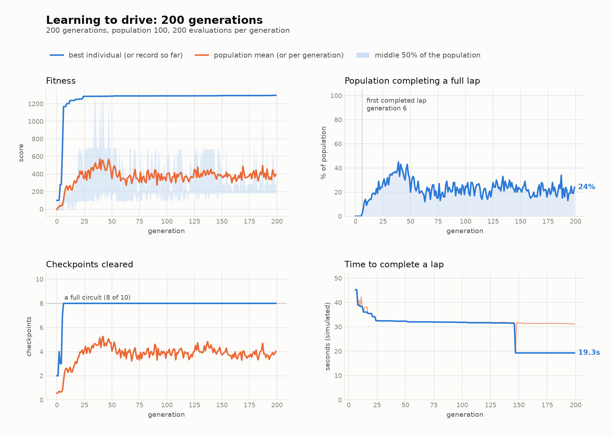
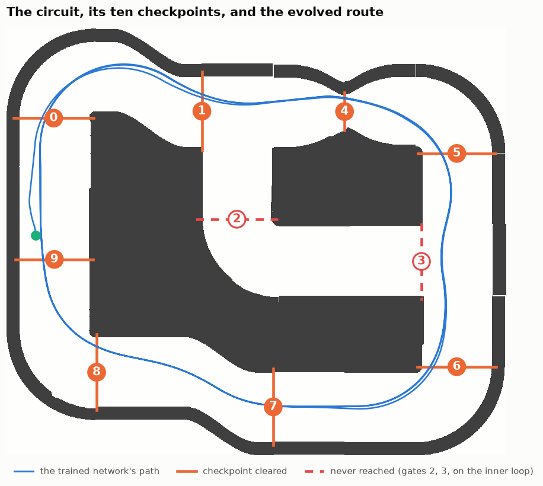

# Neural Network Car Racing

Cars that learn to drive a racetrack. The neural network is written from scratch
in pure Python — no NumPy, no PyTorch, no machine-learning library of any kind —
and it is trained by a genetic algorithm against a headless simulation of the
game's own physics.



<!-- DEMO -->

---

## What it is

A 2D racing game in Pygame, and the neuroevolution pipeline that produces its
opponents. You can play it, or you can run the trainer and watch a population of
random networks turn into drivers.

Each car has five distance sensors and a 320-parameter feed-forward network. The
network sees how far the walls are and how fast it is going; it outputs how hard
to accelerate and how hard to turn. Nothing else. There is no map, no waypoint
list, no notion of a racing line — everything it knows about the circuit it has
to infer from six numbers, fifty times a second.

```
                        ┌──────────────────────────────────────┐
   5 range sensors ────►│  6 → 12 → 10 → 8 → 2                 │───► accelerate
   current speed  ────►│  fully connected, tanh, 320 weights   │───► steer
                        └──────────────────────────────────────┘
```

---

## Quickstart

```bash
pip install -r requirements.txt

python main.py                       # play
python scripts/watch.py --model models/hard.pkl    # watch a trained network drive
python scripts/train.py --generations 200 --population 100 --workers 8
pytest                               # 172 tests
```

Python 3.9 or newer. Only `pygame` and `numpy` are required — and NumPy is used
strictly for the simulator's raycasting, never for the network.

---

## The network, from scratch

`src/nncar/neural_network.py` has no third-party imports, and CI fails the build
if that ever changes — the check parses the module with `ast` and rejects
anything outside `random`, `math` and `copy`. Matrix multiplication, the
addition, the Gaussian weight initialisation via Box–Muller, `tanh`, and the
mutation operator are all written out.

The one place that is not a straightforward transcription is the forward pass,
which is the hottest function in the project: it runs once per car per frame,
and a training run evaluates it tens of millions of times. It is hand-fused —
the multiply-accumulate, the bias and the activation happen in one pass over
plain floats rather than three passes building intermediate matrices — which
makes it **about 2× faster** (2.1× in the committed benchmark; this is a laptop
and the figure moves by ~15% between runs). The composed version is kept
alongside it as the readable definition, and a test checks the two agree bit for
bit across 500 random networks — as does the benchmark itself, before it will
report a ratio.

### Why the inputs are scaled

Sensor distances reach 700 pixels while weights start from `N(0,1)`, so the
first layer's pre-activations average around **10³**. The saturation clamp then
pins **99.7% of hidden units to exactly ±1**, and the layer collapses into
`sign(z)` — a piecewise-constant function of its inputs.

That is close to unlearnable by mutation. Almost every small change to a weight
does nothing at all, and the rare one that flips a sign changes the output
discontinuously; the search sees a flat landscape with occasional cliffs and no
slope to follow. Scaling each sensor by its own maximum range drops mean |z|
from **1060 to 1.98** and saturation to **12%**, which puts `tanh` back in the
region where a small change to a weight makes a small change to the output.

Measured over 200 random networks, and pinned in `tests/test_forward.py`.

---

## How it learns

A population of 100 networks, ranked, with the best few carried through
untouched and the rest bred by mutating the top twenty. 200 generations.

Three choices worth explaining:

**Truncation selection, not fitness-proportional.** Cars that crash immediately
score below zero, and roulette-wheel selection would need every score shifted
positive each generation. Ranking needs no such fudge and does not care how the
scores are scaled.

**Elitism.** The best individual is copied forward unchanged, so the best score
can never fall. That is what makes the fitness curve above a curve rather than a
cloud.

**Crossover is implemented but off by default.** Two networks that both drive
well may have arrived at unrelated internal arrangements — hidden unit three in
one doing the job of unit seven in the other — so splicing their weights usually
produces something worse than either. That is the competing-conventions problem,
and keeping crossover behind `--crossover-rate` makes it an ablation that can be
measured rather than an assumption nobody checked.

### Designing the fitness function was the hard part

The search optimises exactly what you write down, including the parts you did
not mean. Two reward hacks turned up, and the second only became visible after a
full training run.

**Free laps.** The lap counter increments whenever a car crosses the finish line
heading north, and every spawn point sits north of that line. So a network that
reverses about 120 pixels and drives forward again banks a lap in roughly 30
ticks having passed no checkpoints at all — and can repeat that indefinitely.
The same crossing also resets the collision count, which would have laundered
the crash penalty too. Any fitness of the form `laps × w + checkpoints` is
trivially farmed, and a search *will* find it: it is a far shorter path to a
high score than learning to steer. Progress is therefore counted in checkpoints,
each lap records how many it actually cleared, and a lap only counts if it
cleared enough of them.

**Going round twice badly.** Progress was originally the total checkpoints
cleared across every circuit a car attempted. That sounds like "how far did it
get" and is not: a driver clearing eight checkpoints on each of two laps banked
sixteen, beating one that cleared ten in a single clean lap. The first
200-generation champion came back having never cleared more than eight in a row
— it had correctly learned that circling was worth more than improving. Scoring
the **best single circuit** removes the incentive: eight is worth less than ten
however many times it is repeated, and lapping again only costs time.

**Standing still must never be optimal.** A car that never moves takes no
penalty at all, so if crashing cost more than progress pays, the global optimum
would be to sit on the start line. The invariant
`collision_penalty × collision_limit < progress_weight` is what rules that out,
and it is asserted before a run starts rather than discovered after it.

### The track is a double loop



Two of the ten checkpoints sit on an inner section; the other eight lie on the
outer ring. Driving the outer ring is a complete closed lap that crosses the
finish line — it is simply not the route the checkpoint list describes.

This is worth stating plainly because it corrected my own reading of the
results. A trained network clearing "8 of 10" looked like sloppiness, and it is
not: it is what driving the shortest closed circuit correctly looks like. A lap
therefore requires eight checkpoints rather than all ten, and a network that
does find the inner section still scores higher for it.

---

## Results

One run, seed 1234, 200 generations of 100 individuals — 40,000
evaluations and 30.6 million simulated ticks in **22 minutes** on a
4-core laptop.

| | |
|---|---|
| First completed lap | generation **6** |
| Population completing a lap | 0% → **45%** (peak, generation 39) |
| Time to get round | **19.3 s**, down from 45.2 s |
| Best fitness | 100 → **1,296** |
| Population mean fitness | -4 → **395** |

"Time to get round" is measured from the spawn point, so it includes the partial
circuit a car drives before it first reaches the finish line. The lap itself is
faster — see the circuit times below.

Full per-generation data is in [`results/training_log.csv`](results/training_log.csv),
and [`results/config.json`](results/config.json) records the arguments, seed,
commit and library versions needed to reproduce it.

The three difficulty tiers are snapshots of this same run rather than three
separate trainings, so difficulty means something concrete — an earlier
generation of the same lineage:

| Model | Generation | Circuit time | Finishes |
|---|---|---|---|
| `models/easy.pkl` | 6 | 22.9 s | 5/5 |
| `models/medium.pkl` | 21 | 17.3 s | 5/5 |
| `models/hard.pkl` | 193 | 15.3 s | 5/5 |

Circuit time is one lap of the outer ring, averaged over all five spawn points,
excluding the approach from the start position. Each model finishes from every
start position — the final generation's champion was *not* the most reliable, so
`hard` is generation 193 rather than 196.

---

## Engineering

**A headless, deterministic simulation.** The trainer runs the game's own
`Car`/`NPC` physics — there is no second copy that could drift out of step with
what you play. What differs is only the surroundings: no window, no audio, and a
clock counted in ticks rather than read off the wall, so a run means the same
thing on a fast machine as a slow one.

**Walls as an occupancy grid.** Sensor rays and collisions were both answered by
asking Pygame for individual pixels, one at a time, off three 3608×3081
surfaces. A ray walked outward five pixels per step, so its cost scaled with how
far it travelled — which is backwards, because the expensive case is a ray that
sees nothing, and that is exactly what an untrained network produces constantly.
Sampling every point along a ray at once and letting NumPy find the first hit
makes the cost **flat** instead: 34–38 µs regardless of distance, against 789 µs
in corridors and 1111 µs in the open. **21× and 32×**, and the flatness matters
more than either number.

The grid carries two bitplanes, because its two callers disagree about what
counts as solid — the sensors treat any non-zero alpha as a wall, while Pygame's
masks threshold at 127. On this track that is **19,478 pixels** of anti-aliased
fringe, so a single-plane grid would have been quietly wrong for one of them.

**Correctness before speed.** Every optimisation is gated on evidence that it
changed nothing:

- the fused forward pass is bit-identical across 500 random networks, and still
  reproduces a golden file recorded from the original implementation;
- raycasting agrees with the original sensor to within 1e-9 on 99.9% of rays,
  and the remainder differ by exactly one 5-pixel step, never more;
- grid collision agrees with `pygame.mask.overlap` on 5,000 poses with no
  disagreements;
- a recorded 400-tick, five-car trajectory pins the whole simulation. The
  physics is chaotic — each position depends on rays cast from the last — so a
  one-ulp change compounds into a visible divergence within a few hundred ticks,
  which makes a stored trajectory a far sharper instrument than a unit test.

End to end that is **8×**: 1,030 → 8,325 ticks per second in a single process,
measured directly rather than by multiplying the parts together. With eight
workers the trainer sustains around 23,000 ticks per second.

**Parallel and reproducible.** Evaluation is spread across cores with
`multiprocessing`, giving 3.1× on a 4-core, 8-thread laptop. All mutation happens
in the parent process from one seeded stream, so **a run with eight workers
produces bit-identical output to a run with one** — verified across every
deterministic column of the log. Distributing the mutation would have saved
milliseconds and cost that guarantee.

The full methodology and measurements are in
[`docs/engineering-notes.md`](docs/engineering-notes.md), including the things
that turned out not to be what they looked like.

---

## Tests

172 tests, 87% coverage, run on Python 3.9 through 3.13 in
CI with SDL on its dummy drivers.

Beyond the usual, the ones that earn their keep:

- **`test_purity.py`** parses the network module and fails the build if anything
  outside the standard library is imported into it. The from-scratch claim is
  the point of the project, so it is enforced rather than trusted.
- **`test_fitness.py`** scores the free-lap exploit at exactly zero, and asserts
  that one clean lap beats two sloppy ones. Both are regression tests for
  reward hacks that actually happened.
- **`test_trajectory.py`** replays a recorded run and compares it bit for bit.
- **`test_raycast.py`** and **`test_collision_grid.py`** check the fast paths
  against the slow ones they replaced, on the real track.
- **`test_assets.py`** resolves button names statically. They are built by string
  concatenation, so a typo is not a syntax error — it is a crash the first time
  someone opens that screen.

---

## Layout

```
src/nncar/
  neural_network.py    the network - pure Python, enforced
  entities.py          Car / PlayerCar / NPC / Track / Sensor / Checkpoint
  game.py              per-frame helpers shared by the game loop
  screens.py           menus and the race loop
  sim/                 headless simulation: occupancy grid, raycasting,
                       rollouts, fitness  (NumPy allowed here)
  ga/                  the genetic algorithm, parallel evaluation, run logging
scripts/               play, train, watch, benchmark, plot
models/                the three shipped opponents
results/               the published training run
docs/                  engineering notes and benchmark records
tests/
```

---

## Licence

MIT. See [LICENSE](LICENSE).

**Hamzah Ibrahim** — built to understand neural networks from first principles,
then to make them actually learn something.
